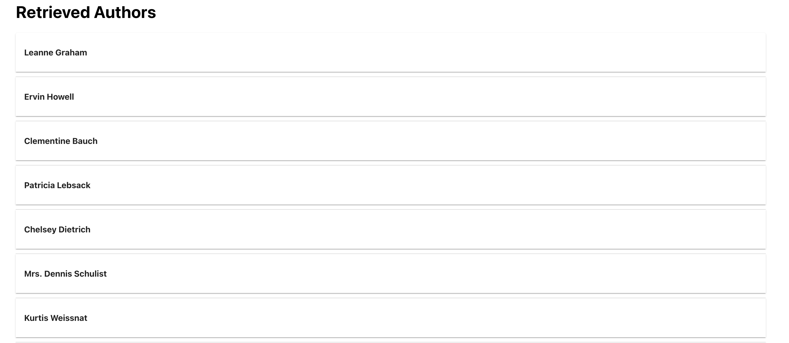

# GDS Assesment Part 1
## How to start the application

### Prerequisites

- Node.js Installed

### Step 1: Install all the dependencies required

- Open up the terminal in your IDE (e.g. Visual Studio Code)
- Go to the directory of assessment 1 `$ cd assessment1`
- Run the following command `$ npm install` in your terminal

### Step 2: Run the web application

- Run the following command `$ npm run start` in your terminal

#### Great ! now you can start using the application.

## How to use the application

### Submit an Author

- At the top of the page, there is a Text Field with the label "Enter Author Name" and the Button "Submit".
- Enter the name of the author you wish to submit (e.g. John Doe)
  
- Press on the Submit button and the author will be shown below "Submitted Authors".
  

### View Retrieved Author Data

- Below the Submitting Author component, you will see a "Retrieved Authors" section.
  
- Click on the first author "Leanne Graham". The information of the Author retrieved from the API call would be shown here.
