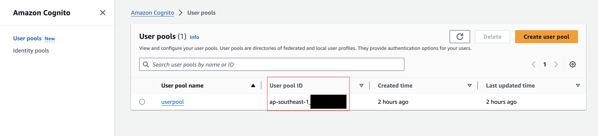
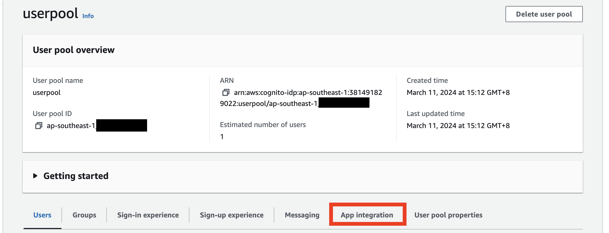
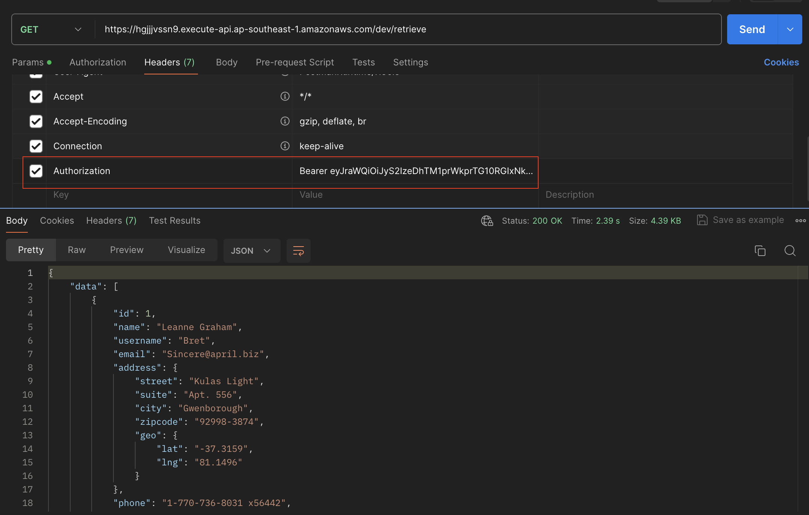

# GDS Assessment Part 2

## Prerequisites
- AWS CLI downloaded with AWS configured with a valid User role. 
- Terraform Installed 

## Step 1: Create the resources with Terraform
1. Run `terraform init` in Terminal
2. Run `terraform plan` in Terminal
3. Run `terraform apply` in Terminal
4. When prompted "Enter a Value", enter `yes` in the terminal


## Step 2: Use the resource created
1. The output url would be shown in the Terminal as shown below

2. However, the output url would not be accessible to the public without Authentication. 

3. To authenticate, we will need to have the User Pool ID, Client ID, Username and Password created by Terraform. We will need to run the command below to generate an Authentication Token.

`$ aws cognito-idp admin-initiate-auth --user-pool-id <USER_POOL_ID> --client-id <CLIENT_ID> --auth-flow ADMIN_NO_SRP_AUTH --auth-parameters USERNAME=user,PASSWORD=Test@123`

- To get the USER_POOL_ID and CLIENT_ID, we will need to go to AWS Console to retrieve it.
- In AWS Console, find "Cognito" in the Search Bar and press enter.
 
- In the AWS Cognito menu, click on "User Pools" and you will see the user pools and the "USER_POOL_ID" would be shown there for the userpool we have created earlier "userpool".

- Click into that user pool and go to "App Integration".

- Scroll all the way down and you will be able to see the "Client ID"


4. Replace the USER_POOL_ID and CLIENT_ID with the data that we have gotten from AWS Console and run the command.
5. You will get an output similar to the following: 
    ```json
    {
        "ChallengeParameters": {},
        "AuthenticationResult": {
            "AccessToken": "ACCESS_TOKEN",
            "ExpiresIn": 3600,
            "TokenType": "Bearer",
            "RefreshToken": "REFRESH_TOKEN",
            "IdToken": "ID_TOKEN"
        }
    }
    ```
6. Insert the "IdToken" into the "Headers" portion in Postman as shown in the example below and the success response would be shown.

